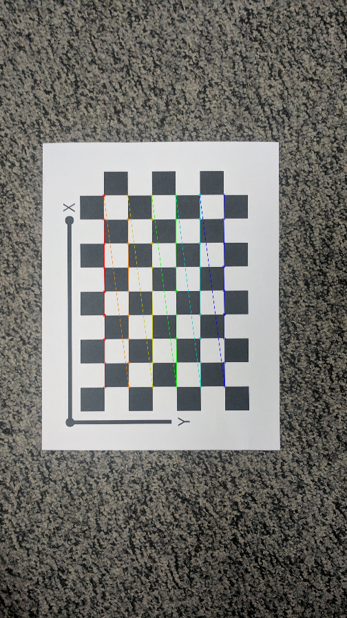

# Zhang-s-Camera-Calibration

|  |  |
|:--:|:--:|
| Actual Corners | Reprojected Image |

This repository contains the academic project exploriuniversity course project page can be found [here](https://rbe549.github.io/spring2023/proj/p2/).


## Table of Contents
- [About The Project](#about-the-project)
- [Repository Structure](#repository-structure)
- [Technologies](#technologies)
- [Installation & Usage](#installation--usage)
- [Contributing](#contributing)


## About The Project
This project is an implementation of Zhang's Camera Calibration algorithm, a fundamental process in 3D computer vision that allows for the extraction of metric information from 2D images. Using a planar pattern observed from multiple orientations, the algorithm estimates the camera's intrinsic and extrinsic parameters, and lens distortion factors. The project provides well-structured, annotated code, and comprehensive documentation, making it a valuable resource for students, researchers, and developers in the field of computer vision and augmented reality. Note: Users may need to adjust parameters to fit their specific camera setup and needs.

## Repository Structure
The repository is structured as follows:


## Technologies

This project leverages several significant technologies:

- **OpenCV**: A robust library in the computer vision field, utilized here for image processing tasks along with its in-built camera calibration and distortion correction functionalities.

- **NumPy**: An essential Python library for handling high-performance computations on multi-dimensional arrays and matrices, a common requirement in computer vision.

- **Zhang's Method**: The cornerstone of this project, providing an effective and efficient approach to camera calibration by observing a planar pattern from multiple orientations.

- **Optimization Techniques**: Employed within the calibration process to determine the best fit camera parameters, minimizing the discrepancy between observed and projected image points.

- **Distortion Models**: Radial and tangential models are applied for accurate image reconstruction and considered during the calibration process.

- **Matplotlib**: Deployed for visualization of calibration results, offering a clear graphical representation of images with overlaid calibration patterns.


## Installation & Usage
To run the project locally, follow these steps:

1. Clone the repository:

```shell
git clone https://github.com/Prasannanatu/sfm_and_nerf.git
 ```
 
Install the required dependencies. You can use the provided requirements.txt file to install the necessary packages. Run the following command:


```shell
pip install -r requirements.txt
 ```
 
 
Run the project using the provided scripts or commands. Refer to the documentation or project files for specific instructions on running the SfM and NeRF algorithms.

## References

1. Wikipedia. "Eight-point Algorithm." [Link](https://en.wikipedia.org/wiki/Eight-point_algorithm)

2. Hartley, R. and Zisserman, A. "Multiple View Geometry in Computer Vision." Second Edition, Cambridge University Press, 2003. [Link](http://users.cecs.anu.edu.au/~hongdong/new5pt_cameraREady_ver_1.pdf)

3. Mildenhall, B., Srinivasan, P. P., Tancik, M., Barron, J. T., Ramamoorthi, R., Ng, R. "NeRF: Representing Scenes as Neural Radiance Fields for View Synthesis." ACM Transactions on Graphics (TOG), Vol. 39, No. 2, Article No. 24, 2020. [Link](https://arxiv.org/abs/2003.08934)

4. RBE-549 Course Project Page. [Link](https://rbe549.github.io/spring2023/proj/p2/)


## Tags

- Computer Graphics
- Comupter Vision
- 3D Reconstruction
- Neural Radiance Fields
- Structure from Motion
- View Synthesis


 
